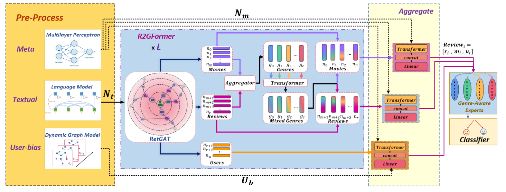

# GUSD: Genre-aware and User-specific Spoiler Detection
[](https://opensource.org/licenses/MIT)

[](https://pytorch.org/)

Official code for **ECML-PKDD 2025** paper [“Unveiling the Hidden: Movie Genre and User Bias in Spoiler Detection”](https://arxiv.org/abs/2504.17834).

Authors: Haokai Zhang\*, Shengtao Zhang\*, Zijian Cai, Heng Wang, Ruixuan Zhu, Zinan Zeng, Minnan Luo†  

<p align="center">
  
</p>

---

## Table of Contents
- [GUSD: Genre-aware and User-specific Spoiler Detection](#gusd-genre-aware-and-user-specific-spoiler-detection)
  - [Table of Contents](#table-of-contents)
  - [📂Project Structure](#project-structure)
  - [🛠 Requirements](#-requirements)
  - [🛠 Dataset Preparation](#-dataset-preparation)
  - [📊 Configuration](#-configuration)
  - [🚀 Quick Start](#-quick-start)
    - [Baseline Training](#baseline-training)
    - [Accelerated / Distributed Training](#accelerated--distributed-training)
    - [Heterogeneous‐Graph Variant](#heterogeneousgraph-variant)
  - [Citation](#citation)
  - [License](#license)

---

## 📂Project Structure

```
GUSD/
├── Code
│   ├── ace_changed_main.py
│   ├── config.py
│   ├── hetero_main.py
│   ├── main.py
│   ├── models_
│   │   ├── graph_encoder
│   │   │   ├── Conv.py
│   │   │   ├── models.py
│   │   ├── main_model.py
│   │   ├── meta_encoder.py
│   │   ├── model_utils.py
│   │   ├── moe.py
│   │   ├── new_moe.py
│   └── utils.py
├── Data
│   ├── process_imdb
│   │   ├── mask_genre.py
│   │   ├── movie_genre.py
│   │   ├── movie_id.py
│   │   ├── nodes.py
│   │   ├── review_genre.py
│   │   ├── semantic.py
│   │   ├── time.py
│   │   └── users.py
│   └── process_lcs
│       ├── build_map.py
│       ├── change_nodes.py
│       ├── genre.py
│       ├── llm
│       │   ├── expl_to_emb.py
│       │   ├── llm.py
│       │   ├── prompt.py
│       │   └── user_prompt.py
│       ├── mask
│       │   ├── mask.py
│       ├── mask_genre.py
│       ├── meta.py
│       ├── movie_genre.py
│       ├── movie_id.py
│       ├── nodes.py
│       ├── review_genre.py
│       ├── semantic
│       │   ├── kg_semantic.py
│       │   ├── semantic.py
│       │   └── user_bias_semantic.py
│       ├── time.py
│       ├── user_centered.py
│       └── z_score.py
├── images
│   └── ovreview.png
├── README.md
├── requirements.txt
```

---

## 🛠 Requirements

- Python ≥ 3.8  
- PyTorch ≥ 1.12.1 
- Install dependencies:
  ```bash
  pip install -r requirements.txt
  ```
Key packages: `torch`, `torch-geometric`, `transformers`, `yacs`, `accelerate`, `numpy`, `pandas`, `scikit-learn`, `tqdm`.

---

## 🛠 Dataset Preparation

1. LCS Dataset
   1. The LCS dataset is available at [Google Drive](https://drive.google.com/drive/folders/1By6_vmaOAaLnZGwrFCGb8UeP8eB2ae4L?usp=share_link). Please apply for access by contacting wh2213210554@stu.xjtu.edu.cn with your institutional email address and clearly state your institution, your research advisor (if any), and your use case of the data.
   2. After getting the raw data, you can preprocessing the data using code in  `Data/process_lcs`.
   3. When you get the preprocessed data, put them in `Data/processed_lcs_data`.
2. IMDb Dataset
   1. We provide preprocessed data for the Kaggle dataset, which can be directly download from [Google Drive](https://drive.google.com/file/d/1lBR1eohYUlJEWxUDHQa23rwx3UwuiUCm/view?usp=sharing).
   2. When you get the preprocessed data, put them in `Data/processed_imdb_data`.

---

## 📊 Configuration

Edit `Code/config.py` or specify parameters when running python files to override defaults.

---

## 🚀 Quick Start

### Baseline Training

```bash
working_dir=$(pwd)
echo -n "Enter train name: "
read train_name
mkdir -p "$working_dir/result"
mkdir -p "$working_dir/model/$train_name"
for seed in 0 1 2 3 4;
do
    python -m main \
        seed $seed \
        device 1 \
        dataset lcs \
        fine_tuning True \
        train.batch_size 128 \
        model.moe.type 'new moe' \
        model.name 'full' \
        model.graph_encoder.name 'K-Genreformer' \
        train.name "" \
        train.save_dir "$working_dir/model/$train_name" \
        >> "$working_dir/result/$train_name.txt"
done
```

### Accelerated / Distributed Training

```bash
working_dir=$(pwd)
echo -n "Enter train name: "
read train_name
mkdir -p "$working_dir/result"
mkdir -p "$working_dir/model/$train_name"

for seed in 0 1 2 3 4
do
    CUDA_VISIBLE_DEVICES=0,1 accelerate launch  \
            --config_file /data3/whr/zhk/Spoiler_Detection/code/MOESD/config.yaml \
            --num_processes 2 \
            --gpu_ids 0,2 \
            --main_process_port 29555 \
            ace_changed_main.py \
            seed $seed \
            model.moe.num_experts 32 \
            model.name 'pe_smoe' \
            model.graph_encoder.in_channels 1152 \
            model.graph_encoder.hidden_channels 1152 \
            train.num_hops 2 \
            train.epochs 20 \
            train.batch_size 128 \
            train.lr 1e-4 \
            train.weight_decay 1e-5 \
            train.weight 1.3 \
            train.save_dir "$working_dir/model/$train_name" \
        >> "$working_dir/result/$train_name.txt"
done
```

### Heterogeneous‐Graph Variant

```bash
working_dir=$(pwd)
echo -n "Enter train name: "
read train_name
mkdir -p "$working_dir/result"
mkdir -p "$working_dir/model/$train_name"

for seed in 0 1 2 3 4
do
    python -m hetero_main \
        seed $seed \
        device 0 \
        dataset lcs \
        fine_tuning False \
        train.batch_size 512 \
        model.name 'hgt' \
        train.name '' \
        train.save_dir "$working_dir/model/" \
        train.note "hgt, lcs" \
        >> "$working_dir/result/$train_name.txt"
done

```

---

## Citation

```bibtex
@article{zhang2025unveiling,
  title={Unveiling the Hidden: Movie Genre and User Bias in Spoiler Detection},
  author={Zhang, Haokai and Zhang, Shengtao and Cai, Zijian and Wang, Heng and Zhu, Ruixuan and Zeng, Zinan and Luo, Minnan},
  journal={arXiv preprint arXiv:2504.17834},
  year={2025}
}
```

---

## License

MIT © Haokai Zhang et al.